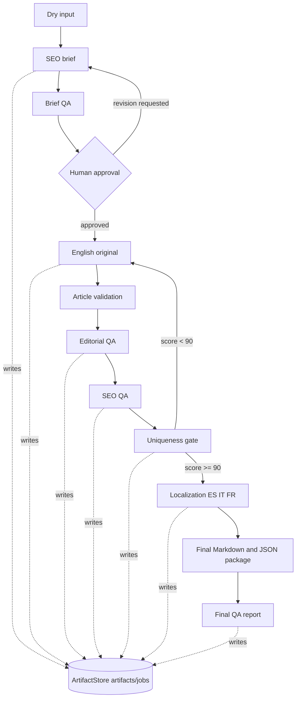

# Architecture Summary

The app is a local Streamlit portfolio demo with file-based persistence. Streamlit handles intake and observability. Services perform workflow work. Models define the contracts. Validators and QA services make stage decisions. Providers isolate uniqueness integrations. Artifacts make every stage inspectable during an interview.

## Main Layers

| Layer | Responsibility |
| --- | --- |
| `app.py` and `ui/` | Local operator experience: job form, progress timeline, artifact panel, QA checklist helpers and controlled error states. |
| `services/` | Application logic for job creation, brief generation, writing, QA, uniqueness, localization, exporters and final QA. |
| `models/` | Pydantic contracts for state, artifacts, content, QA reports, uniqueness and final QA. |
| `validators/` | Deterministic checks for brief, article and SEO constraints. |
| `providers/` | Manual, mock and optional Copyleaks uniqueness providers. |
| `artifacts/jobs/` | Durable local source of truth for every demo job. |

## Pipeline Diagram

## Status And Routing

FR17 is represented by `PipelineState`, `JobMetadata`, `WorkflowStage`, `WorkflowStatus` and `StatusHistoryEntry`. The UI reads these contracts to explain where the job is and what action is available.

FR18 is represented by routing targets, revision notes and QA reports. Brief problems route back to brief work, writing or editorial problems route to writing/editorial review, SEO problems route to SEO QA or writing, uniqueness failures route to uniqueness/writing, localization gaps route to localization, and final package gaps route to final QA.

## Demo Reliability

The demo does not require a hosted backend. Manual and mock uniqueness paths keep the workflow repeatable. Optional Copyleaks support exists as an integration point, but the interview demo remains reliable without credentials.

The ADR in `docs/decisions/0001-offline-first-demo-and-provider-boundaries.md`
records this as an explicit architecture decision: offline-first demo execution
is the supported baseline, while external services remain optional provider
implementations.

The stable scenarios exercise real routing outcomes: BP reaches `approved` and
final package export, LP stops at editorial QA with `needs_revision` for an
unsupported commercial claim, and GP stops at editorial QA with
`needs_human_review` for contextual link-placement judgment.
